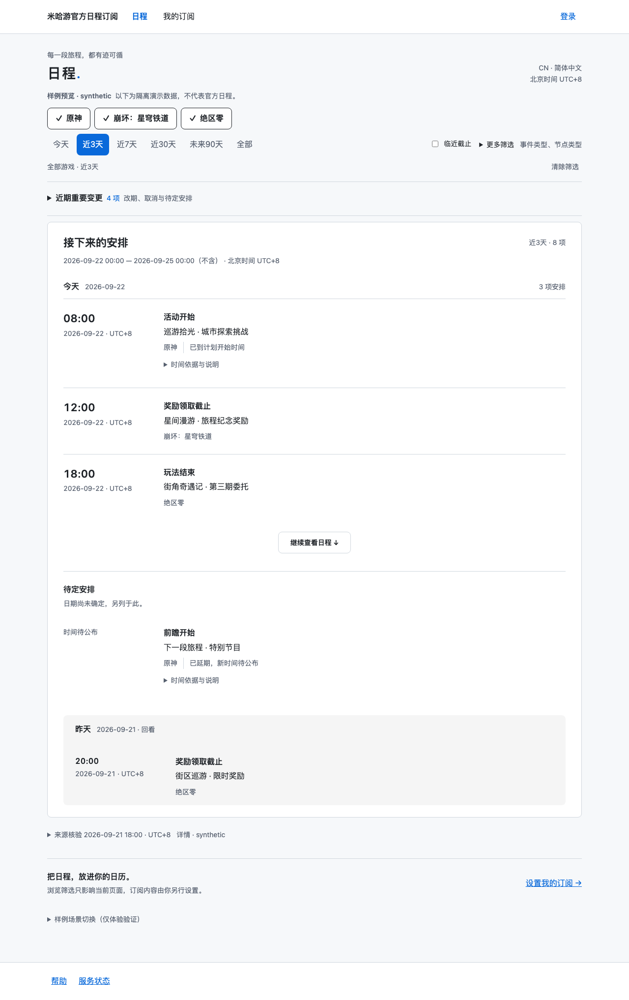
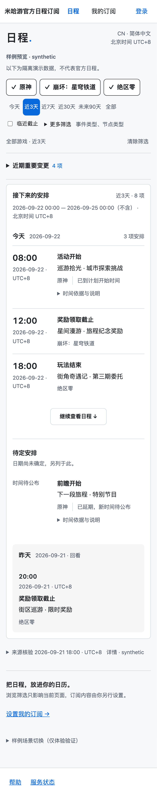
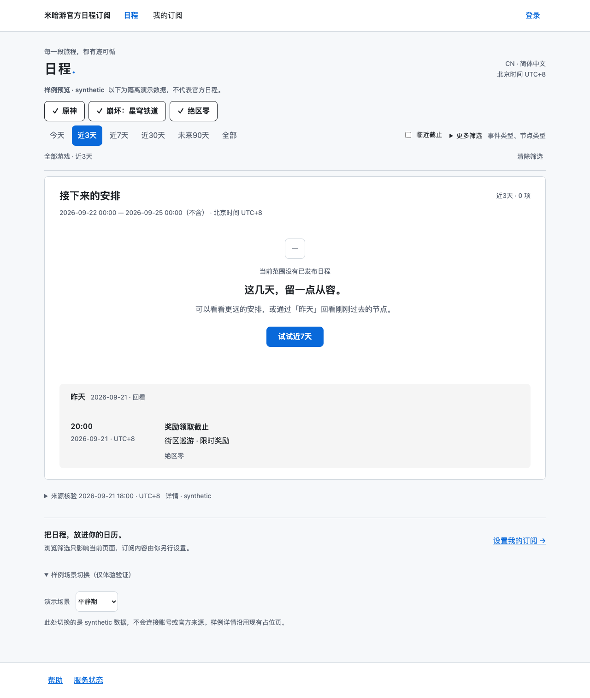
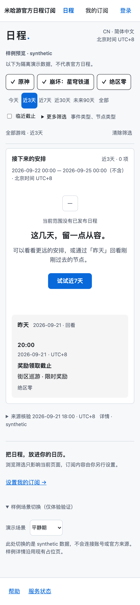

## 任务卡

F1-02 · 日程首页 · 阶段 F1

从 main `43bb8b3f2e956fd4d7177fdb0c1f434414d6f28a` 全新实现，分支 `f1/F1-02-schedule-home`，PR base 为 main。F1-01 PR #11 已于 2026-09-22 合入。G-D1′ 按所有者本次指令定案执行。

所有者明确要求删除原尝试后，旧本地 worktree 与分支已删除，新的独立 worktree 为 `/tmp/hoyo-f1-02`。未复用旧尝试的代码、测试、截图或报告。

## 改动范围

- `apps/web/src/features/schedule/fixtures.ts`：显式 synthetic 隔离数据及六种演示场景。
- `apps/web/src/features/schedule/home.ts`：筛选、URL 白名单、返回恢复、离线提示与加载状态。
- `apps/web/src/features/schedule/render.ts`：列表、时间依据、四种空态、变更与来源状态。
- `apps/web/src/features/schedule/schedule.css`：仅引用 F1-01 token 的响应式样式。
- `apps/web/src/pages/index.astro`：首页骨架与构建时样例列表。
- `tests/e2e/schedule.spec.ts`：U01/U03/U05/U06，桌面与手机实际截图。
- `tests/e2e/mutate-schedule-date.py`：可重跑的反向验证，finally 无条件恢复实现。
- `tests/e2e/evidence/f1-02/`：四张截图、本报告和真实日志。
- 必要范围扩展：`packages/contracts/src/schedule-browse.ts`、同名 `.test.ts`、`src/index.ts`。用户明确要求档位放 contracts；窗口、筛选、排序、状态文案一起保持唯一定义源，独立于业务参数注册表。
- 必要范围扩展：`apps/web/package.json`、`pnpm-lock.yaml` 仅新增已有 `@hoyo/contracts` workspace 依赖，未升级版本、未引入外部依赖。

上述扩展在实现前已说明。不新增共享组件；未修改 token、全站 Layout、详情页、订阅页、Worker 或迁移。主工作区其他任务的未提交文档修改未动。

## 继承的合同

- 前端 v1.0 §4.1—§4.5：骨架、筛选、节点顺序与排序、八种时间状态、数据新鲜度及四种空态。
- 前端 §2.2：返回恢复浏览条件与滚动；§3.1—§3.2：公开浏览和订阅状态隔离；§11.1—§11.2：token、响应式、键盘与对比度；§14.2—§14.3：synthetic 隔离原型、E2 证据。
- 主方案 v2.1 §3.2—§3.3：公开事实、时间精度和依据、撤回与官方取消；§6.3/§6.5：服务端窗口和公共陈旧数据的边界。本卡未实现私人 Feed。
- F1-02 任务卡 D1′：六档、默认近3天、UTC+8 今日零点对齐、列表底部常驻昨天。

实现选择及边界：

1. “全部”消费适配器提供的有限快照，保留其过去/未来条目；昨天单独置底，不重复出现在主列表。未创造 Feed 窗口或新的业务配额。
2. 近期变更使用适配器给定的有限公开更正集合，仅按所选游戏过滤；改期与主列表共享同一节点事实。未添加用户级历史。
3. 首屏先展示第一个日期组，“继续查看日程”展开当前范围其余日期；这是本地 synthetic 加载适配器，没有虚构正式分页合同或真实远端成功。
4. 源故障/待审核缺口优先于无日程文案；已发布条目存在时保留列表，异常只提示受影响游戏。
5. 可选的“将当前游戏选择用于订阅”未提供；普通“设置我的订阅”仅导航到既有页面，不读写任何草稿。本卡没有草稿接收实现，不制造假成功。
6. 数据样例按演示日生成，核验/公告/发布/缓存时间分别设置在上一日不同时间。重试、刷新展示不会被标为新的成功核验。这些字段均为 synthetic，不能当作真实来源证据。

## 交付物

| 交付项 | 状态与实现 |
| --- | --- |
| 页面骨架 | 完成。紧凑游戏/范围筛选、时间列表、变更区、来源核验时间和状态入口；无月历、大图背景或品牌色区分游戏。 |
| 六档 UTC+8 窗口 | 完成。今日零点起算，半开窗口；近3天默认；浏览参数与业务注册表分离。 |
| 昨天带 | 完成。当前日程与待定区之后常驻；surface + tint-ink + `--alpha-band-tint`，不再叠加文字透明度。 |
| 筛选 | 完成。有限多选、CN/简体中文固定标注、临近截止、更多筛选折叠后保留摘要。 |
| 条目与排序 | 完成。时间→动作→名称→游戏→状态；精确时间加身份稳定排序，纯日期专属区，未知日期待定区；长标题换行。 |
| 八种时间/状态 | 完成。已核验精确时间、纯日期、预计及依据、推导及依据、无新时间延期、官方取消、本站撤回及原因、已到计划开始时间。 |
| 近期重要变更 | 完成。改期/取消/撤回/待定均有明确 synthetic 公开依据，不把旧时间当作当前安排。 |
| 数据与空态 | 完成。四种文案和出口；核验时间默认可见，公告/发布代次分别列示；聚合审核缺口；旧缓存时间；离线；失败保留条目与重试。 |
| 浏览与订阅隔离 | 完成。无账号/订阅请求、无自动存储写入，URL 仅公开条件；返回恢复筛选、展开状态和滚动。 |
| E2 与反向验证 | 完成。实际桌面/手机截图；纯日期补午夜触发两条测试失败，还原后复跑通过。 |

## 执行过的命令与结果

环境：macOS / Node `v26.8.1` / pnpm `11.11.0` / Playwright `1.63.0`。命令均在 `/tmp/hoyo-f1-02` 执行，2026-09-22；E2 使用 Chromium Desktop Chrome 与 Pixel 7 仿真。浏览器时钟固定为 `2026-09-22T12:30:00+08:00`，用于复现样例，采集时间与样例时间不是同一概念。

| 实际命令 | 最终实际结果 | 完整输出 |
| --- | --- | --- |
| `pnpm install --frozen-lockfile` | exit 0；Already up to date；Done in 149ms | [install.txt](logs/install.txt) |
| `pnpm lint` | exit 0；Checked 221 files，No fixes applied | [lint.txt](logs/lint.txt) |
| `pnpm typecheck` | exit 0；contracts、worker、web 和 e2e TypeScript 通过 | [typecheck.txt](logs/typecheck.txt) |
| `pnpm test` | exit 0；contracts 18 文件 / 174 测试；worker 29 文件 / 264 测试 | [test.txt](logs/test.txt) |
| `pnpm test:e2e` | exit 0；41 passed、5 skipped（既有设备分工） | [e2e.txt](logs/e2e.txt) |
| `pnpm params:verify` | exit 0；24 条成立，0 条不成立 | [params.txt](logs/params.txt) |
| `pnpm migrate:check` | exit 0；14 个迁移静态检查及空库重放；6 测试通过 | [migrate.txt](logs/migrate.txt) |
| `pnpm build` | 本地未正常退出：Astro 8 页成功；Worker 打印 `--dry-run: exiting now` 后持续等待，手动停止，不记为通过 | [build.txt](logs/build.txt) |
| `python3 tests/e2e/mutate-schedule-date.py` | grep 落地计数 1；变异 exit 1，2 failed / 11 passed；还原后 exit 0，13 passed | [mutation.txt](logs/mutation.txt) |
| `git diff --check` | exit 0，无输出 | 无需附文件 |

日志归档仅移除行尾空白和多余文件尾空行，未改变命令结果。首次失败及修复记录（没有省略失败）：

- 归档后 `git diff --cached --check` 首次因工具日志的行尾空格返回 2；去除日志尾随空白后复查通过。
- 最初沙箱内 `pnpm install --frozen-lockfile`：exit 1，registry DNS `ENOTFOUND` / `fetch failed`；使用批准的安装权限完成安装。为声明已有 workspace 依赖执行 `pnpm install --no-frozen-lockfile`：exit 0；锁文件仅多出本地链接 3 行。随后 frozen 安装通过。
- 最初 `pnpm typecheck`：3 个 TS7053，空态返回值被推断为宽泛 string；为 contracts 的空态联合显式标注类型后通过。该 `&&` 命令链后续 test:contracts/build 当次未执行，后来单独执行通过。
- 样式初次定向 `biome check --write` 报选择器优先级警告；调整选择器后最终 lint 无警告。
- 沙箱内 `pnpm --filter @hoyo/web preview`：exit 1，预览进程启动失败；批准本地预览权限后 exit 0。
- 首轮 E2E：35 passed、4 failed、5 skipped。两设备各失败两条：测试错误地把 `open=""` 当作关闭，再次点击折叠区导致场景选择超时；CSS opacity 字符串 `0.04` 与 token `.04` 被按字符串比较。修正新测试的 DOM 布尔属性判断、按数值比较后 39 passed；增加竞态/键盘测试后的最终结果为 41 passed。[首轮原始日志](logs/e2e-first-failed.txt)
- 本地 `pnpm build` 两次均在 Worker dry-run 完成输出后未自行退出，已定向终止。依次尝试 `WRANGLER_SEND_METRICS=false pnpm build`、`CI=true WRANGLER_SEND_METRICS=false pnpm build`、`CI=true WRANGLER_SEND_METRICS=false WRANGLER_NO_SKILLS_UPDATE_PROMPTS=true pnpm build`，均复现并已停止。未修改依赖或 Worker 工具链；[禁用遥测日志](logs/build-no-metrics.txt)、[CI 模式日志](logs/build-ci.txt)、[禁用更新提示日志](logs/build-no-update.txt)。不能把终止后包装器的退出码作为构建正常完成证据。PR CI 会运行原始 `pnpm build`，结果另行补充。
- 记录证据后再次在受限沙箱执行 `pnpm lint`：pnpm 因 CI 运行后依赖目录状态差异触发自动安装，报 `ERR_PNPM_ABORTED_REMOVE_MODULES_DIR_NO_TTY`，lint 本身未运行。改用与安装相同的权限环境后 exit 0，锁文件未额外变化。[该次输出](logs/lint-environment-failed.txt)
- 本次 Worker 全量测试未出现 ENGINEERING §7 所述抖动，未改动任何 Worker 测试。

5 条跳过均来自既有 `a11y.spec.ts`：桌面跳过 2 条手机触控/缩放专测；手机跳过 3 条纯计算颜色/对比度用例（这些已在桌面实际执行）。本卡的 20 个设备用例全部执行通过。

## 验收测试

| 验收 ID | 测试文件:用例名 | 实际结果 |
| --- | --- | --- |
| U01 | `tests/e2e/schedule.spec.ts`: 游客看到时间、动作与游戏，不创建用户；首屏包含日程 | 两视口通过；无 API 请求/Cookie/本地写入 |
| U03 | 同文件: 八种时间状态、长标题、日期与未知混排不伪造时刻 | 两视口通过 |
| U03 | 同文件: 六档切换保留今日节点，昨天常驻末尾并采用已验证半透明组合 | 两视口通过 |
| U03 | `packages/contracts/src/schedule-browse.test.ts`: 六档窗口、跨年、纯日期分区、逐档日期边界、同时间稳定身份 | 通过；变异对其中两条产生真实失败 |
| U05 | `tests/e2e/schedule.spec.ts`: 四种空态分别表达；平静期有近7天出口，候选只给聚合信息 | 两视口通过 |
| U05 | 同文件: 三种新鲜度字段分开、陈旧缓存与离线明确标记 | 两视口通过 |
| U05 | 同文件: 加载失败保留条目并可重试，不假称全部加载完成 | 两视口通过 |
| U05 | 同文件: 筛选改变后丢弃旧加载结果，空态出口保留键盘焦点 | 两视口通过 |
| U05 | `packages/contracts/src/schedule-browse.test.ts`: 来源故障/审核缺口优先级、部分故障保留条目与游戏隔离 | 通过 |
| U06 | `tests/e2e/schedule.spec.ts`: 改浏览筛选不改写云配置、草稿或接收方式；URL只含白名单 | 两视口通过；云接口为路由替身，没有正式联调 |
| U06 | 同文件: 返回列表恢复筛选、已展开日程与合理滚动位置 | 两视口通过；详情目标为 F1-01 样例占位页 |
| U28 回归 | `tests/e2e/a11y.spec.ts`: 20 个登记对比度组合、颜色单一来源与基线交互 | 通过；设备分工跳过如上 |
| U03/U05 E2 | `tests/e2e/schedule.spec.ts`: 桌面与手机实际截图、窄屏不裁剪关键内容 | 两视口通过，另检查 320px 横向溢出 |

本卡 U01/U03/U05/U06 无未覆盖 ID；正式云配置、官方来源和远端分页并非本卡的外部验收证据。

## 证据

E2 采集时间：2026-09-22 23:41（Asia/Shanghai）。截图来自仓库 `pnpm test:e2e` 的实际浏览器渲染，不是效果图。所有日程和来源状态均为 synthetic；不作为 E3。

- [桌面日程](desktop-home.png)：Desktop Chrome，1280×720 CSS px，fullPage。
- [手机日程](mobile-home.png)：Pixel 7，412×839 CSS px，设备 DPR 截图。
- [桌面空态](desktop-empty.png)：1280×720 CSS px，fullPage。
- [手机空态](mobile-empty.png)：393×727 CSS px，保留手机 DPR，fullPage。
- 样例来源：`apps/web/src/features/schedule/fixtures.ts`；六种场景可在首页页尾切换。
- 反向验证先执行真实 `grep -c F1_02_DATE_MUTATION`，输出 **1** 后才运行测试；失败点为日期节点进入 timed 数组。脚本恢复源文件，再次运行同一 13 条测试通过。
- 同时使用 Browser 技能检查桌面/手机页面，并人工查看上述 E2 截图。无真实外部账号、发信、客户端证据需求；未访问生产发送链。

## 不在本次范围

事件详情 F1-03、全量错误码映射 F1-04、订阅表单与草稿 F2、账号/真实云接口、私人 ICS、邮件、Push、正式公共分页/来源适配器、部署、月历、深色模式和装饰动效均未实现。

可选的复制游戏到订阅草稿按钮未加入；现有订阅导航不会更改任何设置。未为该入口顺手实现草稿存储。

## 已知问题与回退点

- 本地全量 build 的 Worker dry-run 退出等待尚未解释，七项其余命令通过。提交为待 CI 验证的 PR；不能声称本地八项全部通过。
- 当前为显式 synthetic 原型。来源“重新检查”不伪造恢复成功；公开说明其仍为样例状态。正式来源/分页接入留给后续任务。
- 事件链接沿用 `/events/sample` 占位页；本卡不交付独立事件详情。
- `_Layout.astro` 和站名定义保持 main 原状（当前为“米哈游官方日程订阅”）；未越界修改 F1-01 的站点品牌或其测试。
- JS 关闭时呈现构建时样例列表并显示限制说明；筛选交互需要 JS。真实公共缓存/离线存储未在本卡引入。
- Playwright 手机仿真不等于实机浏览器验收；没有声称达到完整无障碍合规等级。
- 回退点：main `43bb8b3f2e956fd4d7177fdb0c1f434414d6f28a`。本卡无迁移、无生产写入，可通过回退本卡提交恢复 F1-01 首页骨架。
